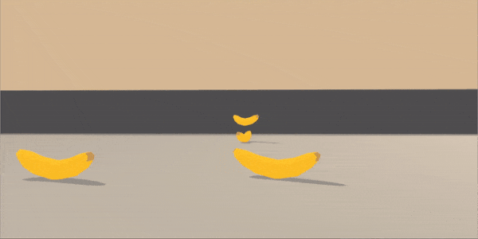
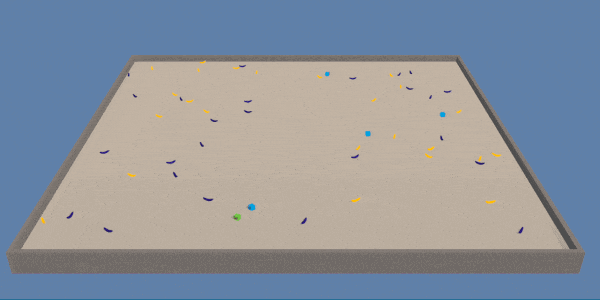

# Navigation

!!! It's Still A Work In Progess !!!\
!!!   No Functioning Code Yet &nbsp; !!!

This project is being done as a part of [Deep Reinforcement Learning Udacity Nanodegree Program](https://eu.udacity.com/course/deep-reinforcement-learning-nanodegree--nd893).

## Environment Description

| Agent View | Top View |
| :---       | :---     |
|  |  |

Although there are multiple agents present in the image above on the right, only a single agent is used to solve this environment.

For this project, I will train an agent to navigate in a large, square world while collecting (giant, delicious) bananas!

In this environment, yellow bananas and blue bananas are constantly generated, and the agent must collect as many yellow bananas as possible while avoiding blue bananas.

Everytime the agent collects a yellow banana, it receives a reward of `+1`.\
Everytime the agent collects a blue banana, it receives a reward of `-1`.

At each time step, the agent receives an observation of its nearby environment: namely, its local ray-cast perception on nearby object as a `37` dimensional vector (state space with size `37`).

the agent must make one of `4` discrete actions:
* `0` - move forward.
* `1` - move backward.
* `2` - turn left.
* `3` - turn right.

The task is episodic, and in order to solve the environment for this project, the agent must get an average score of `+13` over 100 consecutive episodes, or trials.
