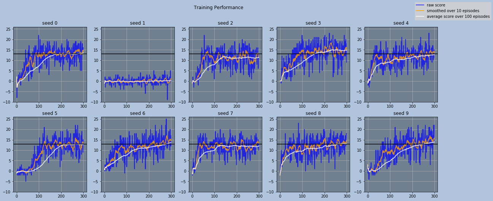
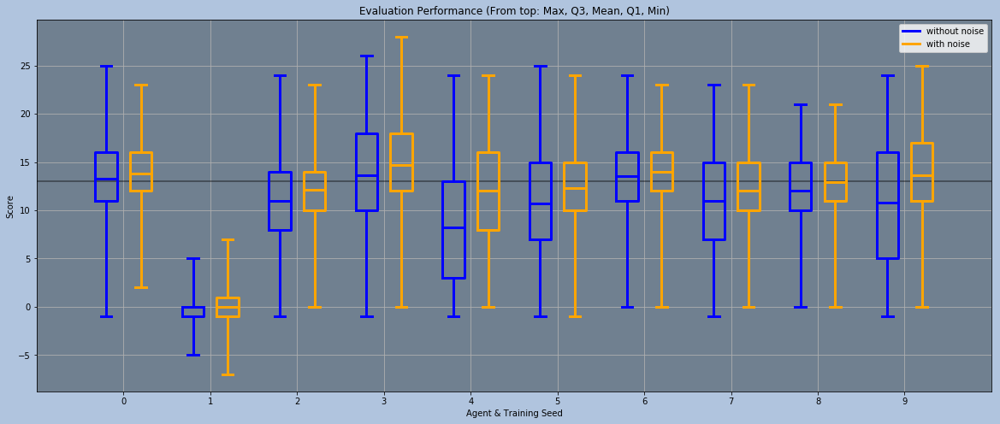

# Report of the Implementation & Performance

This report is made as a part of the project.

## Agent Algorithm

The algorithm for DQN agent implemented in `dqn_agent.py` and `model.py` is based on the [Rainbow algorithm by Google's DeepMind](https://arxiv.org/abs/1710.02298).

The baseline code is from the solution scripts for DQN lessons provided in [Udacity's DRL nanodegree repository](https://github.com/udacity/deep-reinforcement-learning). However, I modified the code progressively and significantly as I implemented one DQN extension after another:

1) First, I added [Double Q-Learning](https://arxiv.org/abs/1509.06461) by using the best action predicted by the local(online), not by the target network, when evaluating the next state with the target network.

2) Then, [Prioritized Experienced Replay](https://arxiv.org/abs/1511.05952) was implemented by adding another `deque` object in `ReplayBuffer` that tracks the priorities for each experience stored. The experiences are sampled according to their priorities—raised to the power of the fixed priority exponent parameter `a`—and their losses are weighted by the importance-sampling parameter `beta`. Calculated losses are fed back into `ReplayBuffer` as new updated priorities.

3) Next, I replaced the original DQN architecture in `model.py` with a [Dueling Architecture](https://arxiv.org/abs/1511.06581). I splitted the last few layers into two branches, one branch calculating the state-value and the other calculating 'advantages', and then added the calculated state-value to the 'advantage' values to get the final Q-values.

4) After that, I made another change in `ReplayBuffer` to implement [Learning from Multi-step Bootstrap Targets](https://arxiv.org/abs/1602.01783). The modification was simply adding another small `deque` with the maximum length of the `n_multisteps` parameter and storing the recent experiences here instead of putting them directly into the memory buffer. This small `deque` is copied and appended to the memory buffer only when it's full. The next state in the sampling is replaced with the last state in each set of experiences, and the rewards are weighted by the discount factor and then summed.

5) Another simple modification was made in the model to turn my original network into a [Noisy Network](https://arxiv.org/abs/1706.10295). I wrote a custom PyTorch module for noisy linear layers that contains both normal parameters and noisy parameters. This module can use either independent unit gaussian noise or factorized gaussian noise. The noise can be also turned off entirely using a method provided in the module. All linear layers after branching part in the network were replaced with this new module.

6) Finally, I modified most of the parts in both scripts in order to use [Distributional Learning](https://arxiv.org/abs/1707.06887). Supports with parameterized bounds [`v_min`, `v_max`] were added, the output size of the DQN was multiplied by another new parameter `n_atoms`, the Q-values are computed by calculating the expected value using the output distribution of the network and the supports, and the Kullback-Leibler divergence is used instead of Mean Squared Errors as the loss function.

## Hyperparameters

There are many hyperparameters to tune as each extension came with its own additional parameters. I ran many experiments with different hyperparameter settings and settled with these values:

```python
hyperparams = {
    'seed':                0,       # random seed

    'buffer_size':         100000,  # size of the experience replay buffer
    'batch_size':          8,       # number of experiences to sample at each learning step
    'start_since':         8,       # number of experiences to store before it begins learning (>= 'batch_size')
    'gamma':               0.99,    # discount factor
    'target_update_every': 1,       # how often to update the target network
    'tau':                 1e-3,    # how much to update the target network at every update
    'lr':                  5e-4,    # learning rate
    'update_every':        1,       # how often to update the online network

    'priority_eps':        1e-3,    # small values added to priorities in order to have nonzero priorities
    'a':                   0.5,     # priority exponent parameter

    'n_multisteps':        3,       # number of steps to consider for multistep learning

    'initial_sigma':       0.05,    # initial noise parameter value for noisy net
    'linear_type':         'noisy', # which linear layers to use ('linear' or 'noisy'; 'linear' to disable noisy net)
    'factorized':          False,   # whether to use factorized gaussian noise or not

    'v_min':               -10,     # minimum support value for distributional learning
    'v_max':               10,      # maximum support value for distributional learning
    'n_atoms':             51       # number of supports for distributional learning
}

train_params = {
    'n_episodes': 300,                                    # number of episodes to train the agent for
    'eps_start':  0.,   'eps_end':  0.,  'eps_decay': 0., # initial, minimum epsilon values and decay rate for epsilon-greedy policy
    'beta_start': 0.4,   'beta_end': 1.0                  # importance-sampling weight for prioritized experience replay
}
```

My hyperparameter search wasn't comprehensive since I did not try making changes to some parameters as much as I did for others. However, I decided that these values were sufficient enough to get <strike>descent</strike>decent results within a limited number of episodes.

The architecture of my DQN is as follows:
<table class="unchanged rich-diff-level-one">
  <thead><tr>
    <th align="center" colspan="2">Layer (Input Dimensions, Output Dimensions)</th>
  </tr></thead>
  <tr>
    <td align="center" colspan="2">Input (, [batch_size, 37])</td>
  </tr>
  <tr>
    <td align="center" colspan="2">Linear ([batch_size, 37], [batch_size, 256])</td>
  </tr>
  <tr>
    <td align="center" colspan="2">Linear ([batch_size, 256], [batch_size, 256])</td>
  </tr>
  <tr>
    <td align="center" colspan="2">Linear ([batch_size, 256], [batch_size, 256])</td>
  </tr>
  <tr>
    <td align="center" colspan="1">Noisy Linear ([batch_size, 256], [batch_size, 128])</td>
    <td align="center" colspan="1">Noisy Linear ([batch_size, 256], [batch_size, 128])</td>
  </tr>
  <tr>
    <td align="center" colspan="1">Noisy Linear ([batch_size, 128], [batch_size, n_atoms])</td>
    <td align="center" colspan="1">Noisy Linear ([batch_size, 128], [batch_size, action_size * n_atoms])</td>
  </tr>
  <tr>
    <td align="center" colspan="2">Output (, [batch_size, action_size, n_atoms])</td>
  </tr>
</table>

ReLU is used as the activation function for hidden layers, and no activation function is applied to the output; when calculating the probability distributions, softmax is applied to the raw output separately outside of the network.

## Training & Evaluation

With the hyperparameter setting listed above, I ran 10 test runs, each with different seed (0-9).

Here are the training plots for the test runs:


As the plot shows, about half of the agents were able to solve the environment during the 300 episodes of training, and most of the others were also getting close to the 13 points line—except for the one that failed terribly. It seemed that having memories mostly dominated by negative experiences hindered the process of learning drastically.

Additionally, in order to get a good measure of their after-training performance, I ran for 2000 more episodes with each trained agent: 1000 episodes with noise left on, and another 1000 episodes with noise turned entirely off, incrementing the environment seed from 0 to 19 every 100 episodes.

I plotted the results in a bar and whisker plot:


The plot above, indeed, indicates that at least about half of the trained agents are able to achieve the solving score of 13, with maybe one of them scoring just a tiny bit below the required score.

Also, what's interesting is that the agents performed generally better with noise; they seemed to have embraced uncertainty as part of their strategies. Although not visible in these plots, I also noticed that the magnitude of their noise parameters tended to go up as the training progressed. When I observed their interactions visually, I found that they sometimes scored poorly because they got stuck in a state where they kept repeating the same pattern of actions (e.g. keep spinning right, turning right and left, or moving back and forth). With noise, they showed less of this phenomenon than when there was no noise. I reason that they used noise to add stochasticity of their actions in such situations, increasing the likelihood of escaping that state.

The weights for the best model—one with seed=3—was saved in `pretrained.pth`.

## Future Ideas

The major drawback of these agents seems to be falling into such state where the agents performs repetitive actions and fails to escape. Although this may be resolved with more training, I also see the lack of memory of its past observations as part of the issue. I believe making use of past states from few time steps back would enable these agents to overcome this challange and acheive even higher performance with the same number of episodes or even less. (e.g. using 3 most recent observation as the input)
